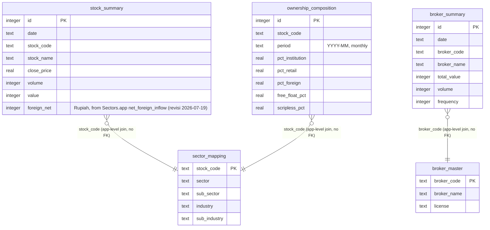

# Fase 1 — Schema Diagram & Rationale

Skema D1 di `migrations/0001_initial_schema.sql`. Dokumen ini jelasin
kenapa tiap tabel bentuknya begitu, dan gimana skema ini map ke scope
fitur v1 final (lihat `docs/api-contract.md` buat kontrak endpoint-nya).

**Revisi 2026-07-18**: `bid`/`offer`/`bid_volume`/`offer_volume` DIHAPUS
dari `stock_summary`, tabel baru `ownership_composition` ditambah.
Alasan: riset kompetitor (`docs/neobdm-competitor-research.md`) nemuin
kalau "Balance Position Chart" (nama fitur yang jadi acuan schema ini)
sebenarnya adalah **komposisi kepemilikan** (Foreign/Local per kategori
investor, data KSEI bulanan) — BUKAN order book bid/offer harian seperti
yang diasumsikan sebelumnya. Field bid/offer itu juga salah satu dari
dua field yang dikonfirmasi TIDAK ada di vendor data manapun yang dicek
(`docs/fase-2-vendor-validation.md`), jadi koreksi ini sekaligus nutup
gap arsitektur ingestion yang lagi diributkan di Fase 2
(`docs/fase-2-worker-network-test.md`).

## Diagram (ERD, mermaid)

Catatan: D1/SQLite gak ada FK enforcement yang dipakai di sini (join di
level query aja, `broker_code`/`stock_code` sebagai natural key). Alasan:
data broker_summary dan stock_summary di-refresh harian dari sync job
independen (Fase 2) — FK constraint bakal bikin urutan sync jadi kaku
(broker_master/sector_mapping harus sync duluan tiap kali). Trade-off ini
disengaja untuk fase ini; revisit kalau muncul masalah data-integrity nyata.

## Kenapa 5 tabel ini

### `stock_summary`
Sumber tunggal buat hampir semua fitur v1: Market Summary, Transaction
Chart, Seasonality Table, DAN — paling penting — Top Accumulation by
Investor Type / Top Accumulation Foreign, karena field `foreign_net` di
sini **granular per saham** (pengganti Bandarmology). Balance Position
Chart TIDAK lagi pakai tabel ini — lihat `ownership_composition` di
bawah.

**Revisi 2026-07-19** (`docs/fase-2-vendor-validation.md` Opsi C):
desain awal `foreign_buy`/`foreign_sell` + `foreign_net` (generated,
`buy - sell`) asumsi sumbernya IDX `GetStockSummary` langsung (Fase 0,
lot-denominated, split buy/sell). Sumber v1 yang benar-benar dipakai
ternyata vendor pihak ketiga (Sectors.app `GET /v2/foreign-flow/{symbol}/`),
yang cuma expose `net_foreign_inflow` — satu angka Rupiah, BUKAN lot,
BUKAN split buy/sell. `foreign_buy`/`foreign_sell` DIHAPUS dari tabel
(gak ada sumber v1 yang bisa mengisinya), `foreign_net` jadi kolom
nullable biasa (bukan lagi `GENERATED`), diisi langsung dari
`net_foreign_inflow`. Lihat `docs/api-contract.md` endpoint Top
Accumulation untuk konsekuensi ke response API (`domestic` gugur,
`buy`/`sell` gak ada di response).

### `broker_summary`
**AGGREGATE ONLY** — market-wide total per broker per hari, BUKAN
breakdown per saham. Ini keputusan eksplisit dari Fase 0
(`docs/fase-0-findings.md`, dikonfirmasi ulang `docs/fase-0-findings-v2.md`):
IDX gak expose broker-per-saham lewat endpoint publik manapun yang
ditemukan. Tabel ini tetap dibuat karena datanya beneran ada dan valid
buat dipakai di level lain (mis. ranking broker paling aktif market-wide
per hari) — TAPI tidak bisa dan tidak boleh dipakai buat fitur
Bandarmology/Broker Stalker/Broker Summary (yang butuh breakdown per
saham) — fitur-fitur itu di v2-placeholder.

### `broker_master`
Registry sederhana (kode, nama, lisensi broker) dari
`participants.getBrokerSearch`. Dipakai buat resolve `broker_code` di
`broker_summary` jadi nama yang enak dibaca di UI.

### `sector_mapping`
Diverifikasi ada dari `NeaByteLab/IDX-API` — dua sumber independen
konsisten: `ListedCompany/GetCompanyProfilesDetail` (`profile.sector`,
`profile.subSector`) dan stock-screener API
(`sector`/`subSector`/`industry`/`subIndustry`). Basis buat Sector
Activity dan Rotation Chart (agregasi `stock_summary` di-join by sector).

### `ownership_composition` (baru, revisi 2026-07-18)
Basis buat Balance Position Chart versi yang benar (komposisi
kepemilikan per kategori investor, bukan order book). Snapshot bulanan,
bukan harian — beda cadence dari `stock_summary`/`broker_summary`
(itu sebabnya `period` formatnya `YYYY-MM`, bukan `YYYYMMDD`, dan gak
ikut pola index `(date, stock_code)` yang dipakai tabel time-series
harian lainnya).

**BELUM TERVERIFIKASI**: sumber data + cara aksesnya. NeoBDM
nampilinnya dari file yang kelihatan kayak export resmi KSEI, tapi kita
belum cek langsung apakah/gimana file itu bisa didapat (publik? perlu
akun KSEI? berbayar?). Kolom di tabel ini juga cuma versi ringkas dari
apa yang keliatan di UI NeoBDM (`%Institution`/`%Retail`/`%Foreign`,
scripless %, free float %) — breakdown detail per kategori investor
(Foreign Bank/Asuransi/Dapen/dst yang keliatan di legend chart mereka)
SENGAJA belum dimasukkan ke schema karena field-name aslinya belum
kekonfirmasi dari sumber data manapun, cuma dari legend UI. Revisi tabel
ini begitu sumber KSEI dicek beneran — jangan asumsikan struktur final.

## Keputusan eksplisit: Inventory Chart

Task ini minta keputusan eksplisit soal Inventory Chart — apakah butuh
data broker-level atau bisa dari OHLC/volume biasa.

**Keputusan: Inventory Chart PINDAH ke v2-placeholder.**

Alasan: "Inventory Chart" di platform bandarmology (referensi: Stockbit,
RTI Business, dan platform sejenis) secara definisi umum adalah **running
cumulative position broker tertentu di saham tertentu** — total akumulasi
net-buy/net-sell broker X di saham Y dari waktu ke waktu. Ini secara
definisi butuh breakdown broker+saham granular, persis data yang sudah
dikonfirmasi TIDAK tersedia dari endpoint publik IDX (sama kayak
Bandarmology/Broker Stalker/Broker Summary). Gak ada versi "aggregate
market-wide" dari Inventory Chart yang masuk akal — beda dari Top
Accumulation (yang emang by-design market-wide per investor-type, bukan
per-broker), Inventory Chart secara konsep spesifik ke satu broker. Jadi
turun ke v2-placeholder, sejajar Bandarmology/Broker Stalker/Broker Summary.

## Open items / belum terjawab

- **Sumber data `ownership_composition`**: belum dicek sama sekali —
  lihat catatan di section tabel itu di atas. Blocker buat Balance
  Position Chart jadi v1 beneran (schema udah ada, tapi ingestion-nya
  belum, dan sumbernya sendiri belum diverifikasi).
- **`stock_summary.value` dan `stock_summary.frequency`**: **DISKIP 2026-07-18**
  (keputusan Kris) — kolom tetap ada di schema (nullable, gak dihapus,
  karena dua-duanya field asli yang dikonfirmasi ada di IDX GetStockSummary
  betulan, Fase 0), tapi TIDAK diisi oleh ingestion v1 karena GOAPI gak
  punya field ini. Konsekuensi: sort/filter by `value`/`frequency` di
  Market Summary (`docs/api-contract.md`) gak fungsional di v1, kolomnya
  bakal null. Dengan bid/offer juga udah dihapus, ini ngebuka jalan buat
  `stock_summary` full disuplai dari GOAPI lewat Cloudflare Worker cron —
  **Opsi A (ingestion dari jaringan non-datacenter Kris) TIDAK lagi
  diperlukan untuk `stock_summary`**, lihat update di
  `docs/fase-2-worker-network-test.md`.
- **Company announcement / buyback**: lihat `docs/buyback-verification.md`
  — kesimpulan: data TIDAK terstruktur, gak ada tabel `company_announcement`
  di migration ini.
- **Money Management**: SKIP total di fase ini sesuai instruksi task —
  belum ada definisi fitur yang jelas, jadi belum ada schema.
- **D1 rows-read cost di scale besar**: index yang ada (`date, stock_code`
  dan `stock_code, date` masing-masing tabel time-series) cover pola query
  yang diketahui sekarang (by-date dan by-stock). Kalau nanti muncul pola
  query baru (mis. by-sector langsung tanpa join), perlu index tambahan —
  belum dibuat sekarang biar gak over-index tabel yang belum ada data
  volumenya.
