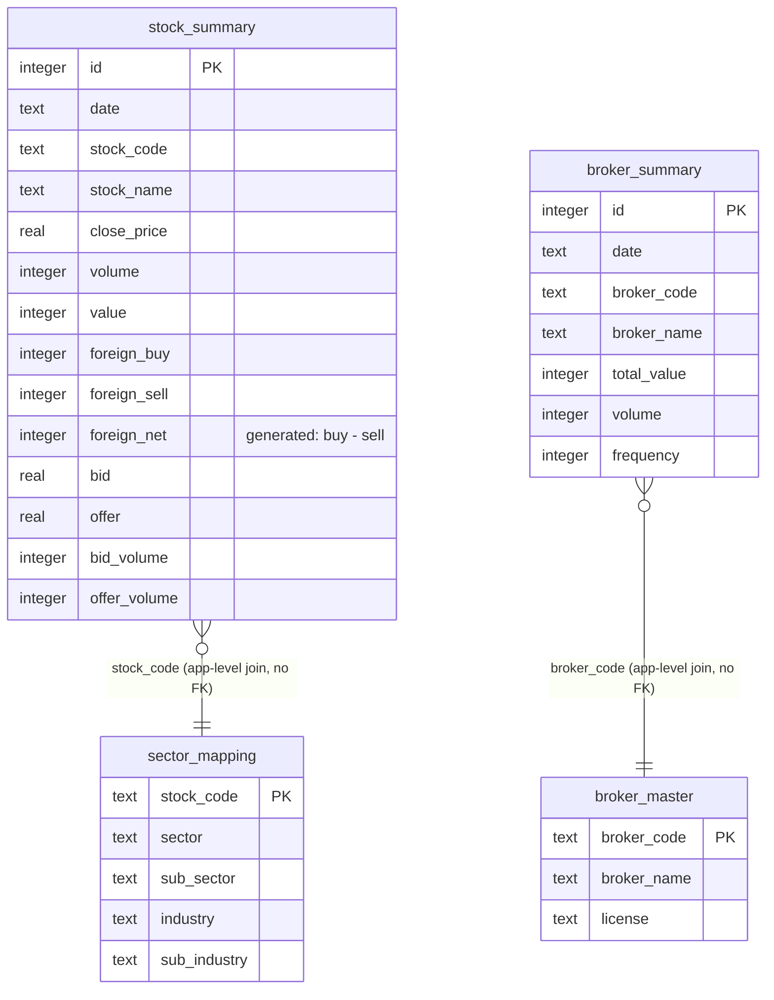

# Fase 1 — Schema Diagram & Rationale

Skema D1 di `migrations/0001_initial_schema.sql`. Dokumen ini jelasin
kenapa tiap tabel bentuknya begitu, dan gimana skema ini map ke scope
fitur v1 final (lihat `docs/api-contract.md` buat kontrak endpoint-nya).

## Diagram (ERD, mermaid)

Catatan: D1/SQLite gak ada FK enforcement yang dipakai di sini (join di
level query aja, `broker_code`/`stock_code` sebagai natural key). Alasan:
data broker_summary dan stock_summary di-refresh harian dari sync job
independen (Fase 2) — FK constraint bakal bikin urutan sync jadi kaku
(broker_master/sector_mapping harus sync duluan tiap kali). Trade-off ini
disengaja untuk fase ini; revisit kalau muncul masalah data-integrity nyata.

## Kenapa 4 tabel ini

### `stock_summary`
Sumber tunggal buat hampir semua fitur v1: Market Summary, Transaction
Chart, Seasonality Table, Balance Position Chart, DAN — paling penting —
Top Accumulation by Investor Type / Top Accumulation Foreign, karena field
`foreign_buy`/`foreign_sell`/`foreign_net` di sini **granular per saham**
(diverifikasi Fase 0, ini pengganti Bandarmology).

`foreign_net` pakai `GENERATED ALWAYS AS ... STORED` (bukan dihitung di
app layer) supaya query "top net foreign buy hari ini" bisa langsung
`ORDER BY foreign_net DESC` tanpa compute ekstra tiap request — penting
buat D1 yang billing-nya rows-read based, generated+stored column gak
nambah cost dibanding kolom biasa.

### `broker_summary`
**AGGREGATE ONLY** — market-wide total per broker per hari, BUKAN
breakdown per saham. Ini keputusan eksplisit dari Fase 0
(`docs/fase-0-findings.md`, dikonfirmasi ulang `docs/fase-0-findings-v2.md`):
IDX gak expose broker-per-saham lewat endpoint publik manapun yang
ditemukan. Tabel ini tetap dibuat karena datanya beneran ada dan valid
buat dipakai di level lain (mis. ranking broker paling aktif market-wide
per hari) — TAPI tidak bisa dan tidak boleh dipakai buat fitur
Bandarmology/Broker Stalker/Broker Summary (yang butuh breakdown per
saham) — fitur-fitur itu di v2-placeholder.

### `broker_master`
Registry sederhana (kode, nama, lisensi broker) dari
`participants.getBrokerSearch`. Dipakai buat resolve `broker_code` di
`broker_summary` jadi nama yang enak dibaca di UI.

### `sector_mapping`
Diverifikasi ada dari `NeaByteLab/IDX-API` — dua sumber independen
konsisten: `ListedCompany/GetCompanyProfilesDetail` (`profile.sector`,
`profile.subSector`) dan stock-screener API
(`sector`/`subSector`/`industry`/`subIndustry`). Basis buat Sector
Activity dan Rotation Chart (agregasi `stock_summary` di-join by sector).

## Keputusan eksplisit: Inventory Chart

Task ini minta keputusan eksplisit soal Inventory Chart — apakah butuh
data broker-level atau bisa dari OHLC/volume biasa.

**Keputusan: Inventory Chart PINDAH ke v2-placeholder.**

Alasan: "Inventory Chart" di platform bandarmology (referensi: Stockbit,
RTI Business, dan platform sejenis) secara definisi umum adalah **running
cumulative position broker tertentu di saham tertentu** — total akumulasi
net-buy/net-sell broker X di saham Y dari waktu ke waktu. Ini secara
definisi butuh breakdown broker+saham granular, persis data yang sudah
dikonfirmasi TIDAK tersedia dari endpoint publik IDX (sama kayak
Bandarmology/Broker Stalker/Broker Summary). Gak ada versi "aggregate
market-wide" dari Inventory Chart yang masuk akal — beda dari Top
Accumulation (yang emang by-design market-wide per investor-type, bukan
per-broker), Inventory Chart secara konsep spesifik ke satu broker. Jadi
turun ke v2-placeholder, sejajar Bandarmology/Broker Stalker/Broker Summary.

## Open items / belum terjawab

- **Company announcement / buyback**: lihat `docs/buyback-verification.md`
  — kesimpulan: data TIDAK terstruktur, gak ada tabel `company_announcement`
  di migration ini.
- **Money Management**: SKIP total di fase ini sesuai instruksi task —
  belum ada definisi fitur yang jelas, jadi belum ada schema.
- **D1 rows-read cost di scale besar**: index yang ada (`date, stock_code`
  dan `stock_code, date` masing-masing tabel time-series) cover pola query
  yang diketahui sekarang (by-date dan by-stock). Kalau nanti muncul pola
  query baru (mis. by-sector langsung tanpa join), perlu index tambahan —
  belum dibuat sekarang biar gak over-index tabel yang belum ada data
  volumenya.
